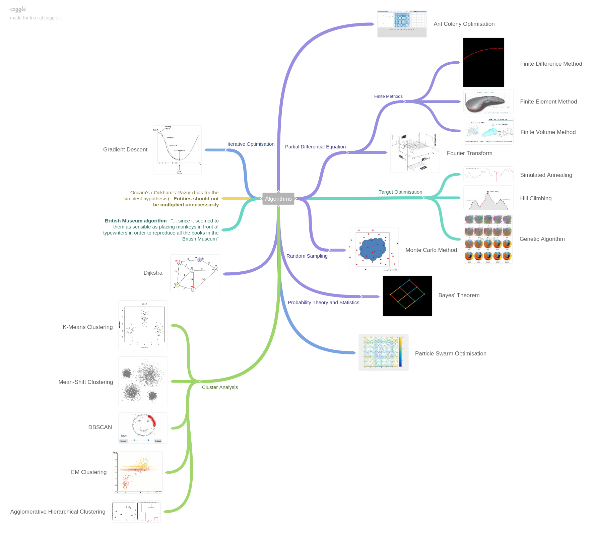

Algorithms
==========

Mind Map
--------

https://coggle.it/diagram/Wi5oYCue3QABUTIE/f776afc45f1043295ceb134e56c2d2f60d057b95e497375193ce8c8088a56a70[Coggle Link]

Table of contents
-----------------

- Partial Differential Equation
  * <<Fourier, Fourier Transform>>
  * Finite Methods
    ** <<FDM, Finite Difference Method>>
    ** <<FEM, Finite Element Method>>
    ** <<FVM, Finite Volume Method>>
- Random Sampling
  * <<Monte-Carlo, Monte Carlo Method>>
- Probability Theory and Statistics
  * <<Bayes, Bayes' Theorem>>
- Target Optimisation
  * <<Hill, Hill Climbing>>
  * <<Annealing, Simulated Annealing>>
  * <<Genetic, Genetic Algorithm>>
- <<PSO, Particle Swarm Optimisation>>
- <<ACO, Ant Colony Optimisation>>
- <<Dijkstra, Dijkstra>>
- Iterative Optimisation
  * <<GD, Gradient Descent>>
- Cluster Analysis
  * <<K-Means, K-Means Clustering>>
  * <<Mean-Shift, Mean-Shift Clustering>>
  * <<DBSCAN, DBSCAN>>
  * <<EM, EM Clustering>>
  * <<Agglomerative-Hierarchical, Agglomerative Hierarchical Clustering>>
- <<References>>

[[Fourier]]
Fourier Transform
-----------------

解偏微分方程。微分次数越高越好。

image::Fourier{sp}Transform.jpg[Fourier Transform]

- 如果看了此文你还不懂傅里叶变换那就过来掐死我吧 from 伯乐在线, _http://blog.jobbole.com/70549/_

[[FDM]]
Finite Difference Method
------------------------

简单粗暴，应用最广，解偏微分方程。

image::Finite{sp}Difference{sp}Method.svg[Finite Difference Method]

[[FEM]]
Finite Element Method
---------------------

解不光滑，几何边界复杂的偏微分方程。

image::Finite{sp}Element{sp}Method.jpg[Finite Element Method]

[[FVM]]
Finite Volume Method
--------------------

image::Finite{sp}Volume{sp}Method.jpg[Finite Volume Method]

[[Monte-Carlo]]
Monte Carlo method
------------------

把所有复杂问题都转化为基于随机数和各种分布的简单算术问题，这就是蒙特卡洛算法的精髓。比如模拟分子的运动，能表现出分子数量大，随机性强的特点。

image::Monte{sp}Carlo{sp}Method.jpg[Monte Carlo Method]

- 人工智能绝不会统治人类, _http://blog.sina.com.cn/s/blog_6c7e111d0102wckj.html_
- Monte Carlo Method visualisation demo, _https://codepen.io/terrencemiao/full/GygRMp/_

[[Bayes]]
Bayes' Theorem
--------------

_A_ and _B_ are events and _P(B)_ ≠ 0.

- _P(A|B)_ is a conditional probability: the likelihood of event _A_ occurring given that _B_ is true.
- _P(B|A)_ is also a conditional probability: the likelihood of event _B_ occurring given that _A_ is true.
- _P(A)_ and _P(B)_ are the probabilities of observing _A_ and _B_ independently of each other; this is known as the marginal probability.

image::https://qph.ec.quoracdn.net/main-qimg-003a7aaa0935215238a082f0412fb564[Bayes' Theorem, 301, 85]

- **Likelihood** _P(B|A)_ - How probable is the evidence given that our hypothesis is true?
- **Prior** _P(A)_ - How probable was our hypothesis before observing the evidence?
- **Marginal** _P(B)_ - How probable is the new evidence under all possible hypothesis? _P(B) = Σ~i~ P(B|A~i~) P(A~i~)_
- **Posterior** _P(A|B)_ - How probable is our hypothesis given the observed evidence? (Not directly computable)

image::Bayes'{sp}Theorem.svg[Bayes' Theorem]

- 数学之美番外篇：平凡而又神奇的贝叶斯方法, _http://mindhacks.cn/2008/09/21/the-magical-bayesian-method/_

[[Hill]]
Hill Climbing
-------------

优化目标函数。收敛速度快，容易陷入局部最优解。

image::Hill{sp}Climbing.png[Hill Climbing]

[[Annealing]]
Simulated Annealing
-------------------

优化目标函数。牺牲速度，加入随机项以避免局部最优解。

image::Simulated{sp}Annealing.gif[Simulated Annealing]

[[Genetic]]
Genetic Algorithm
-----------------

优化目标函数。智能性高，速度慢。

image::Genetic{sp}Algorithm.jpg[Genetic Algorithm]

- 遗传算法：内存中的进化, _http://songshuhui.net/archives/10462_

[[PSO]]
Particle Swarm Optimisation
---------------------------

image::Particle{sp}Swarm{sp}Optimisation.gif[Particle Swarm Optimisation]

In the process of Particle Swarm Optimisation, there are two scalars: Velocity and Positions (1, 2, ... D are dimension).

image::PSO{sp}Velocity.jpg[PSO Velocity]

image::PSO{sp}Positions.jpg[PSO Positions]

_pBest~i~^d^_ be the best known position of particle _i_ and _gBest^d^_ be the best known position of the entire swarm. _w_ is weight, _c~1~_, _c~2~_ are selected by the practitioner and control the behaviour and efficacy of the PSO method. _rand~1~^d^_, _rand~2~^d^_ are random number between [0, 1].

image::PSO{sp}Formula.jpg[PSO Formula]

[[ACO]]
Ant Colony Optimisation
-----------------------

image::Ant{sp}Colony{sp}Optimisation.gif[Visual demo of Ant Colony Optimisation]

- Ant Colony Optimization (ACO), _https://terrencemiao.github.io/blog/2017/06/30/Ant-Colony-Optimization-ACO/_

[[Dijkstra]]
Dijkstra
--------

....
    if dis[k] + d(k,u) < dis[u]:
        dis[u] = dis[k] + d(k,u)
....

From a dynamic programming point of view, Dijkstra's algorithm is a successive approximation scheme that solves the dynamic programming functional equation for the shortest path problem by the Reaching method.

[[GD]]
Gradient Descent
----------------

[[K-Means]]
K-Means Clustering
------------------

image::K-Means{sp}Clustering.gif[K-Means Clustering]

K-Means have very few computations. It thus has a linear complexity O(n). K-Median use the median vector of the group, and is less sensitive to outliers (because of using the Median) but is much slower for larger datasets as sorting is required on each iteration.

image::K-Means{sp}Clustering.png[K-Means Clustering]

Source: _https://www.naftaliharris.com/blog/visualizing-k-means-clustering/_

[[Mean-Shift]]
Mean-Shift Clustering
---------------------

image::Mean-Shift{sp}Clustering{sp}I.gif[Mean-Shift Clustering]
image::Mean-Shift{sp}Clustering{sp}II.gif[Mean-Shift Clustering]

Mean-Shift Clustering is a centroid-based, sliding-window-based algorithm that attempts to find dense areas of data points. At every iteration the sliding window is shifted towards regions of higher density by shifting the center point to the mean of the points within the window.

[[DBSCAN]]
DBSCAN
------

Density Based Spatial Clustering of Applications with Noise (DBSCAN), is a density based clustered algorithm. It does not require a per-set number of clusters at all. It also identifies outliers as noises. It is able to find arbitrarily sized and arbitrarily shaped clusters quite well.

image::DBSCAN.gif[DBSCAN]

Source: _https://www.naftaliharris.com/blog/visualizing-dbscan-clustering/_

[[EM]]
EM Clustering
-------------

image::EM{sp}Clustering{sp}using{sp}GMMs.gif[EM Clustering]

Expectation Maximization (EM) Clustering using Gaussian Mixture Models (GMM) are a lot more flexible in terms of cluster covariance than K-Means Clustering. Since GMMs use probabilities, they can have multiple clusters per data point.

[[Agglomerative-Hierarchical]]
Agglomerative Hierarchical Clustering
-------------------------------------

image::Agglomerative{sp}Hierarchical{sp}Clustering.gif[Agglomerative Hierarchical Clustering]

Hierarchical clustering algorithms actually fall into 2 categories: top-down or bottom-up.

Bottom-up algorithms treat each data point as a single cluster at the outset and then successively merge (or agglomerate) pairs of clusters until all clusters have been merged into a single cluster that contains all data points. Bottom-up hierarchical clustering is therefore called hierarchical agglomerative clustering or HAC.

[[References]]
References
----------

- Naughty's blog, _https://my.oschina.net/taogang_
- Five Most Popular Similarity Measures implementation in Python, _http://dataaspirant.com/2015/04/11/five-most-popular-similarity-measures-implementation-in-python/_
- The 5 Clustering Algorithms Data Scientists Need to Know, _https://towardsdatascience.com/the-5-clustering-algorithms-data-scientists-need-to-know-a36d136ef68_
- scikit-learn clustering methods overview, _http://scikit-learn.org/stable/modules/clustering.html_

image::Clustering{sp}Algorithms{sp}Comparison.png[A comparison of the Clustering Algorithms in scikit-learn]
