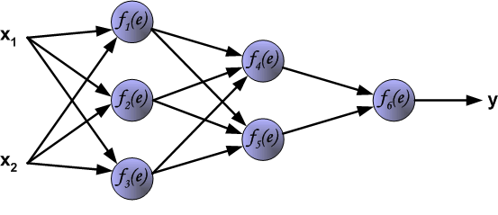
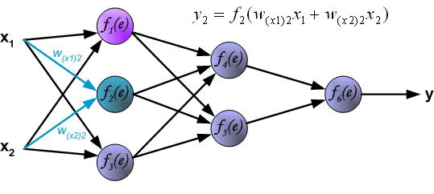
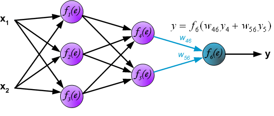
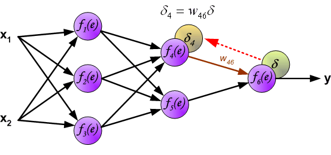
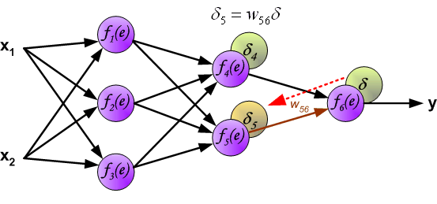
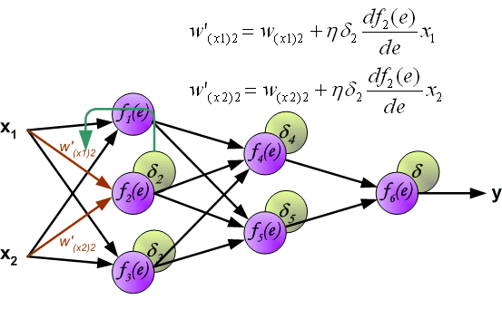
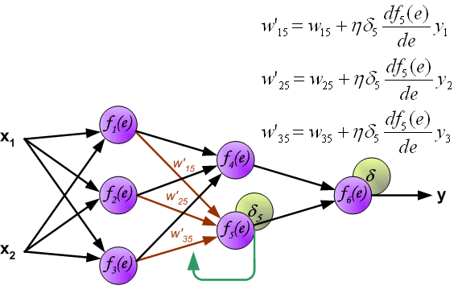

Principles of backpropagation
=============================

**e^&#960;i^ + 1 = 0**

To illustrate this process of multi-layer neural network employing backpropagation algorithm.

Each neuron is composed of two units. First unit adds products of weights coefficients and input signals. The second unit realises nonlinear function, called neuron activation function. Signal _e_ is adder output signal, and _y = f(e)_ is output signal of nonlinear element. Signal _y_ is also output signal of neuron.

image::img01b.gif[img01b]

To teach the neural network we need training data set. The training data set consists of input signals (_x1_ and _x2_) assigned with corresponding target (desired output) _z_. The network training is an iterative process. **In each iteration weights coefficients of nodes are modified using new data from training data set.** Modification is calculated using algorithm described below:

Each teaching step starts with forcing both input signals from training set. After this stage we can determine output signals values for each neuron in each network layer. Pictures below illustrate how signal is propagating through the network, Symbols _w~(xm)n~_ represent weights of connections between network input _x~m~_ and neuron _n_ in input layer. Symbols _y~n~_ represents output signal of neuron _n_.

image::img02.gif[img02]

image::img04.gif[img04]

Propagation of signals through the hidden layer. Symbols _w~mn~_ represent weights of connections between output of neuron _m_ and input of neuron _n_ in the next layer.

image::img05.gif[img05]

image::img06.gif[img06]

Propagation of signals through the output layer.

In the next algorithm step the output signal of the network _y_ is compared with the desired output value (the target), which is found in training data set. The difference is called error signal _d_ of output layer neuron.

image::img08.gif[img08]

It is impossible to compute error signal for internal neurons directly, because output values of these neurons are unknown. For many years the effective method for training multiplayer networks has been unknown. Only in the middle eighties the backpropagation algorithm has been worked out. The idea is to propagate error signal _d_ (computed in single teaching step) back to all neurons, which output signals were input for discussed neuron.

The weights' coefficients _w~mn~_ used to propagate errors back are equal to this used during computing output value. Only the direction of data flow is changed (signals are propagated from output to inputs one after the other). This technique is used for all network layers. If propagated errors came from few neurons they are added. The illustration is below:

image::img11.gif[img11]

image::img12.gif[img12]

image::img13.gif[img13]

When the error signal for each neuron is computed, **the weights coefficients of each neuron input node may be modified.** In formulas below _df(e)/de_ represents derivative of neuron activation function (which weights are modified).

image::img14.gif[img14]

image::img16.gif[img16]

image::img17.gif[img17]

image::img19.gif[img19]

Coefficient _h_ affects network teaching speed. There are a few techniques to select this parameter.

The first method is to start teaching process with large value of the parameter. While weights coefficients are being established the parameter is being decreased gradually.

The second method, more complicated, starts teaching with small parameter value. During the teaching process the parameter value is being increased when the teaching is advanced and then decreased again in the final stage. Starting teaching process with low parameter value enables to determine weights coefficients signs.

Start forward wise requires multiply large matrices for each layer until multiply a large matrix by a vector in the output layer. However, if start backwards, that is, start multiplying a matrix by a vector, get another vector and so forth. **The beauty in backpropagation is that doing more efficient matrix-vector multiplications instead of matrix-matrix multiplications.**

References
----------

- Principles of training multi-layer neural network using backpropagation, _http://galaxy.agh.edu.pl/~vlsi/AI/backp_t_en/backprop.html_
- What is the best visual explanation for the back propagation algorithm for neural networks?, _https://www.quora.com/What-is-the-best-visual-explanation-for-the-back-propagation-algorithm-for-neural-networks_
- Neural Networks Tutorial - A Pathway to Deep Learning, _http://adventuresinmachinelearning.com/neural-networks-tutorial/_
- CS231n Winter 2016 Lecture 4 Backpropagation Neural Networks, _https://www.youtube.com/watch?v=59Hbtz7XgjM_
