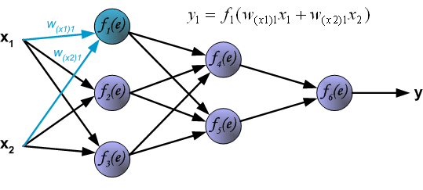

Principles of backpropagation
=============================

To illustrate this process of multi-layer neural network employing backpropagation algorithm.

image::img01.gif[img01]

Each neuron is composed of two units. First unit adds products of weights coefficients and input signals. The second unit realises nonlinear function, called neuron activation function. Signal _e_ is adder output signal, and _y = f(e)_ is output signal of nonlinear element. Signal _y_ is also output signal of neuron.

image::img01b.gif[img01b]

To teach the neural network we need training data set. The training data set consists of input signals (_x1_ and _x2_) assigned with corresponding target (desired output) _z_. The network training is an iterative process. In each iteration weights coefficients of nodes are modified using new data from training data set. Modification is calculated using algorithm described below:

Each teaching step starts with forcing both input signals from training set. After this stage we can determine output signals values for each neuron in each network layer. Pictures below illustrate how signal is propagating through the network, Symbols _w~(xm)n~_ represent weights of connections between network input _x~m~_ and neuron _n_ in input layer. Symbols _y~n~_ represents output signal of neuron _n_.

image::img03.gif[img03]

References
----------

- Principles of training multi-layer neural network using backpropagation, _http://galaxy.agh.edu.pl/~vlsi/AI/backp_t_en/backprop.html_
- Neural Networks Tutorial - A Pathway to Deep Learning, _http://adventuresinmachinelearning.com/neural-networks-tutorial/_

Sandbox
-------

e^&#960;i^ + 1 = 0, H~2~O and x^10^. Some^super-text^ and some~sub-text~.
